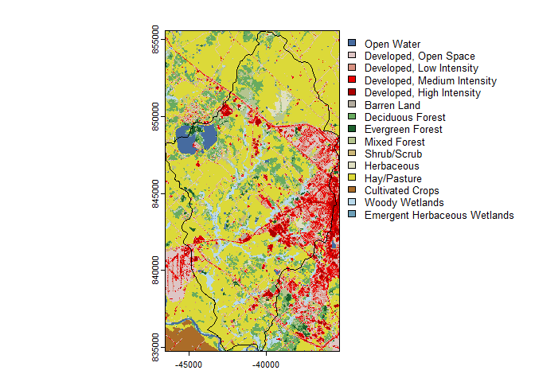
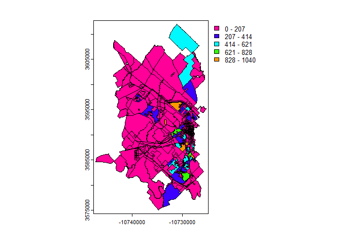

<!-- README.md is generated from README.Rmd. Please edit that file -->

# SELECTRdata

<!-- badges: start -->

[](https://www.repostatus.org/#wip)
<!-- badges: end -->

SELECTRdata provides convenience functions for downloading raster and
tabular data used in the Spatially Explicit Load Enrichment Calculation
Tool (SELECT). By providing a SpatRaster object of the target watershed,
functions are available to download cropped: - [National Land Cover
Dataset](https://www.mrlc.gov/) - [FEMA USA
Structures](https://disasters.geoplatform.gov/USA_Structures/) - [Census
Blocks](https://tigerweb.geo.census.gov/tigerwebmain/TIGERweb_restmapservice.html) -
[TIGER County
Boundaries](https://tigerweb.geo.census.gov/tigerwebmain/TIGERweb_restmapservice.html) -
[USDA Agricultural Census](https://www.nass.usda.gov/)

Sources to add: - Point sources (via ECHO or echor) - MS4 urbanized
areas (via US Census)

## Installation

You can install the development version of SELECTRdata like so:

``` r
# FILL THIS IN! HOW CAN PEOPLE INSTALL YOUR DEV PACKAGE?
```

## Example

## MRLC National Land Cover Dataset

``` r
library(conflicted)
#> Warning: package 'conflicted' was built under R version 4.3.3
library(SELECTRdata)
library(terra)
#> Warning: package 'terra' was built under R version 4.3.3
#> terra 1.7.78

## we need a template file, this is the thomsoncreek watershed in Texas
dem <- system.file("extdata", "thompsoncreek.tif", package = "SELECTR")
dem <- terra::rast(dem)

gpkg <- system.file("extdata", "thompsoncreek.gpkg", package = "SELECTR")
wbd <- terra::vect(gpkg, layer = "wbd")

dem <- terra::mask(dem, wbd,
                   filename = tempfile(fileext = ".tif"))
```

``` r
## set the following GDAL options to connect to
## MRLC's AWS S3 bucket
set_gdal_config("AWS_NO_SIGN_REQUEST", "YES")

## download the NLCD file cropped to the extents of the watershed
nlcd <- SELECTRdata::download_nlcd(template = dem, 
                                   overwrite = TRUE,
                                   progress = 1)
#> |---------|---------|---------|---------|=========================================                                          
plot(nlcd)
```



### FEMA US Buildings

``` r
buildings <- download_buildings(template = dem)
plot(buildings)
```


### TIGER Counties

``` r
cen_blocks <- download_census_blocks(dem, "2020")
plot(cen_blocks, "POP100")
```



``` r
counties <- download_counties(dem)
plot(counties)
```


You’ll still need to render `README.Rmd` regularly, to keep `README.md`
up-to-date. `devtools::build_readme()` is handy for this.
